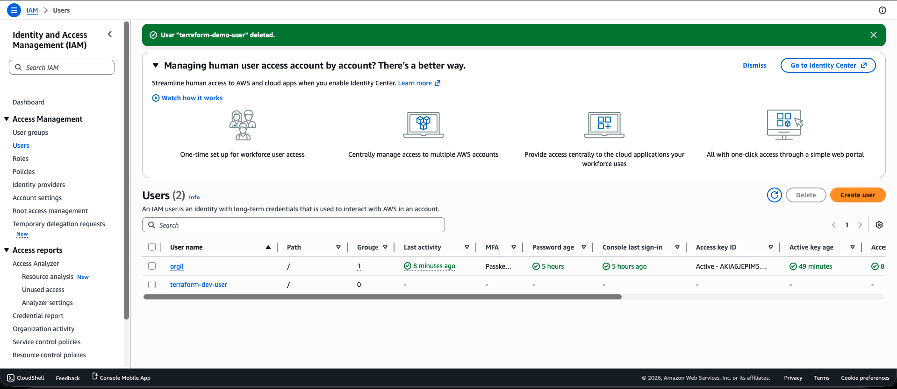
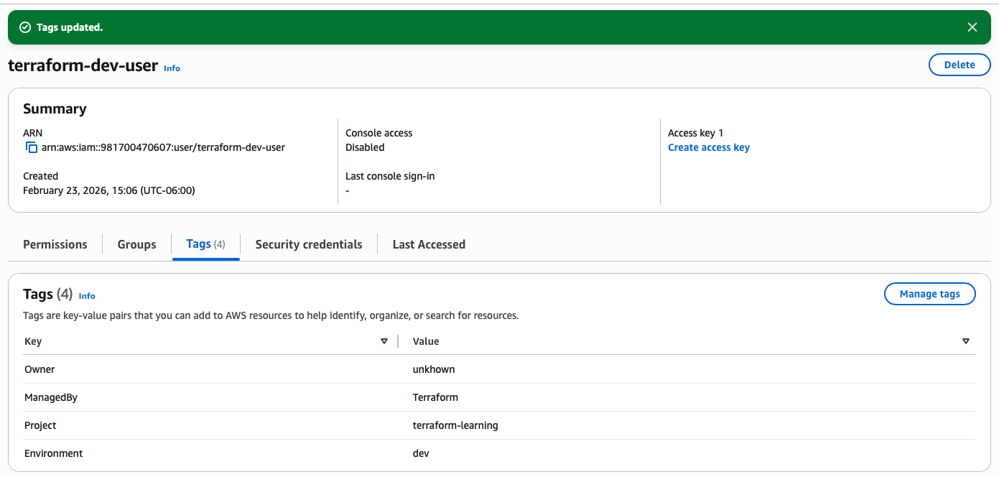

# 1. IAM user creation
### Initialize the Terraform project folder.
(base) mac@mac AWS % terraform init             
```bash
Initializing the backend...
Initializing modules...
- aws_iam_user in ../../../../infra-modules/iam-user
Initializing provider plugins...
- Reusing previous version of hashicorp/aws from the dependency lock file
- Using previously-installed hashicorp/aws v5.100.0

Terraform has been successfully initialized!

You may now begin working with Terraform. Try running "terraform plan" to see
any changes that are required for your infrastructure. All Terraform commands
should now work.

If you ever set or change modules or backend configuration for Terraform,
rerun this command to reinitialize your working directory. If you forget, other
commands will detect it and remind you to do so if necessary.
```
### Preview changes before applying.

(base) mac@mac AWS % terraform plan             
```bash
Terraform used the selected providers to generate the following execution plan. Resource actions are indicated with the following symbols:
  + create

Terraform will perform the following actions:

  # module.aws_iam_user.aws_iam_user.this will be created
  + resource "aws_iam_user" "this" {
      + arn           = (known after apply)
      + force_destroy = false
      + id            = (known after apply)
      + name          = "terraform-dev-user"
      + path          = "/"
      + tags          = {
          + "Environment" = "dev"
          + "ManagedBy"   = "Terraform"
          + "Owner"       = "orgil"
          + "Project"     = "terraform-learning"
        }
      + tags_all      = {
          + "Environment" = "dev"
          + "ManagedBy"   = "Terraform"
          + "Owner"       = "orgil"
          + "Project"     = "terraform-learning"
        }
      + unique_id     = (known after apply)
    }

Plan: 1 to add, 0 to change, 0 to destroy.

────────────────────────────────────────────────────────────────────────────────────────────────────────────────────────────────────────────────────────────────────────────────────

Note: You didn't use the -out option to save this plan, so Terraform can't guarantee to take exactly these actions if you run "terraform apply" now.
```
### Apply the planned changes.

(base) mac@mac AWS % terraform apply
```bash
Terraform used the selected providers to generate the following execution plan. Resource actions are indicated with the following symbols:
  + create

Terraform will perform the following actions:

  # module.aws_iam_user.aws_iam_user.this will be created
  + resource "aws_iam_user" "this" {
      + arn           = (known after apply)
      + force_destroy = false
      + id            = (known after apply)
      + name          = "terraform-dev-user"
      + path          = "/"
      + tags          = {
          + "Environment" = "dev"
          + "ManagedBy"   = "Terraform"
          + "Owner"       = "orgil"
          + "Project"     = "terraform-learning"
        }
      + tags_all      = {
          + "Environment" = "dev"
          + "ManagedBy"   = "Terraform"
          + "Owner"       = "orgil"
          + "Project"     = "terraform-learning"
        }
      + unique_id     = (known after apply)
    }

Plan: 1 to add, 0 to change, 0 to destroy.

Do you want to perform these actions?
  Terraform will perform the actions described above.
  Only 'yes' will be accepted to approve.

  Enter a value: yes

module.aws_iam_user.aws_iam_user.this: Creating...
module.aws_iam_user.aws_iam_user.this: Creation complete after 0s [id=terraform-dev-user]

Apply complete! Resources: 1 added, 0 changed, 0 destroyed.
```



### Let’s change a value manually in AWS and use Terraform to detect the drift.



(base) mac@mac iam-users % terraform plan -refresh-only -detailed-exitcode
```bash
module.aws_iam_user.aws_iam_user.this: Refreshing state... [id=terraform-dev-user]

Note: Objects have changed outside of Terraform

Terraform detected the following changes made outside of Terraform since the last "terraform apply" which may have affected this plan:

  # module.aws_iam_user.aws_iam_user.this has changed
  ~ resource "aws_iam_user" "this" {
        id                   = "terraform-dev-user"
        name                 = "terraform-dev-user"
      ~ tags                 = {
            "Environment" = "dev"
            "ManagedBy"   = "Terraform"
          ~ "Owner"       = "orgil" -> "unkhown"
            "Project"     = "terraform-learning"
        }
      ~ tags_all             = {
          ~ "Owner"       = "orgil" -> "unkhown"
            # (3 unchanged elements hidden)
        }
        # (5 unchanged attributes hidden)
    }


This is a refresh-only plan, so Terraform will not take any actions to undo these. If you were expecting these changes then you can apply this plan to record the updated values in
the Terraform state without changing any remote objects.

────────────────────────────────────────────────────────────────────────────────────────────────────────────────────────────────────────────────────────────────────────────────────

Note: You didn't use the -out option to save this plan, so Terraform can't guarantee to take exactly these actions if you run "terraform apply" now.
```

### Apply the planned changes.

(base) mac@mac iam-users % terraform apply -refresh-only    
```bash          
module.aws_iam_user.aws_iam_user.this: Refreshing state... [id=terraform-dev-user]

Note: Objects have changed outside of Terraform

Terraform detected the following changes made outside of Terraform since the last "terraform apply" which may have affected this plan:

  # module.aws_iam_user.aws_iam_user.this has changed
  ~ resource "aws_iam_user" "this" {
        id                   = "terraform-dev-user"
        name                 = "terraform-dev-user"
      ~ tags                 = {
            "Environment" = "dev"
            "ManagedBy"   = "Terraform"
          ~ "Owner"       = "orgil" -> "unkhown"
            "Project"     = "terraform-learning"
        }
      ~ tags_all             = {
          ~ "Owner"       = "orgil" -> "unkhown"
            # (3 unchanged elements hidden)
        }
        # (5 unchanged attributes hidden)
    }


This is a refresh-only plan, so Terraform will not take any actions to undo these. If you were expecting these changes then you can apply this plan to record the updated values in
the Terraform state without changing any remote objects.

Would you like to update the Terraform state to reflect these detected changes?
  Terraform will write these changes to the state without modifying any real infrastructure.
  There is no undo. Only 'yes' will be accepted to confirm.

  Enter a value: yes


Apply complete! Resources: 0 added, 0 changed, 0 destroyed.
```

### Remove all resources managed by this Terraform folder/state.

(base) mac@mac iam-users % terraform destroy
```bash
module.aws_iam_user.aws_iam_user.this: Refreshing state... [id=terraform-dev-user]

Terraform used the selected providers to generate the following execution plan. Resource actions are indicated with the following symbols:
  - destroy

Terraform will perform the following actions:

  # module.aws_iam_user.aws_iam_user.this will be destroyed
  - resource "aws_iam_user" "this" {
      - arn                  = "arn:aws:iam::**********:user/terraform-dev-user" -> null
      - force_destroy        = false -> null
      - id                   = "terraform-dev-user" -> null
      - name                 = "terraform-dev-user" -> null
      - path                 = "/" -> null
      - tags                 = {
          - "Environment" = "dev"
          - "ManagedBy"   = "Terraform"
          - "Owner"       = "orgil"
          - "Project"     = "terraform-learning"
        } -> null
      - tags_all             = {
          - "Environment" = "dev"
          - "ManagedBy"   = "Terraform"
          - "Owner"       = "orgil"
          - "Project"     = "terraform-learning"
        } -> null
      - unique_id            = "**********" -> null
        # (1 unchanged attribute hidden)
    }

Plan: 0 to add, 0 to change, 1 to destroy.

Do you really want to destroy all resources?
  Terraform will destroy all your managed infrastructure, as shown above.
  There is no undo. Only 'yes' will be accepted to confirm.

  Enter a value: yes

module.aws_iam_user.aws_iam_user.this: Destroying... [id=terraform-dev-user]
module.aws_iam_user.aws_iam_user.this: Destruction complete after 0s

Destroy complete! Resources: 1 destroyed.
```